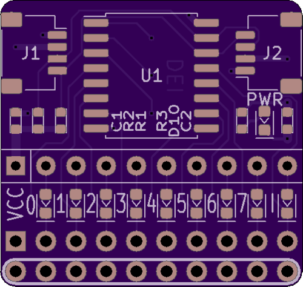
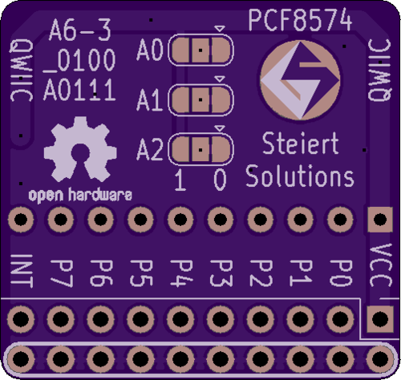

# qgpio
Qwiic GPIO expander

This is a PCF8574 based GPIO expander with Qwiic connectors.
Each GPIO and the INT signal go to a header pin and have and LED that indicates when the signal is low.  The signals go to a dual row header with one row grounded so that any signal can be shorted with a jumper.  There is also an LED to indicate when the board is powered. 

This design is released under CC0 1.0 Universal license.

[Schematic print](qgpio.pdf)

[Follow this project on Hackaday](https://hackaday.io/project/173648-qgpio)

You can [order bare boards from OSH Park](https://oshpark.com/shared_projects/7lsaSVpY)

